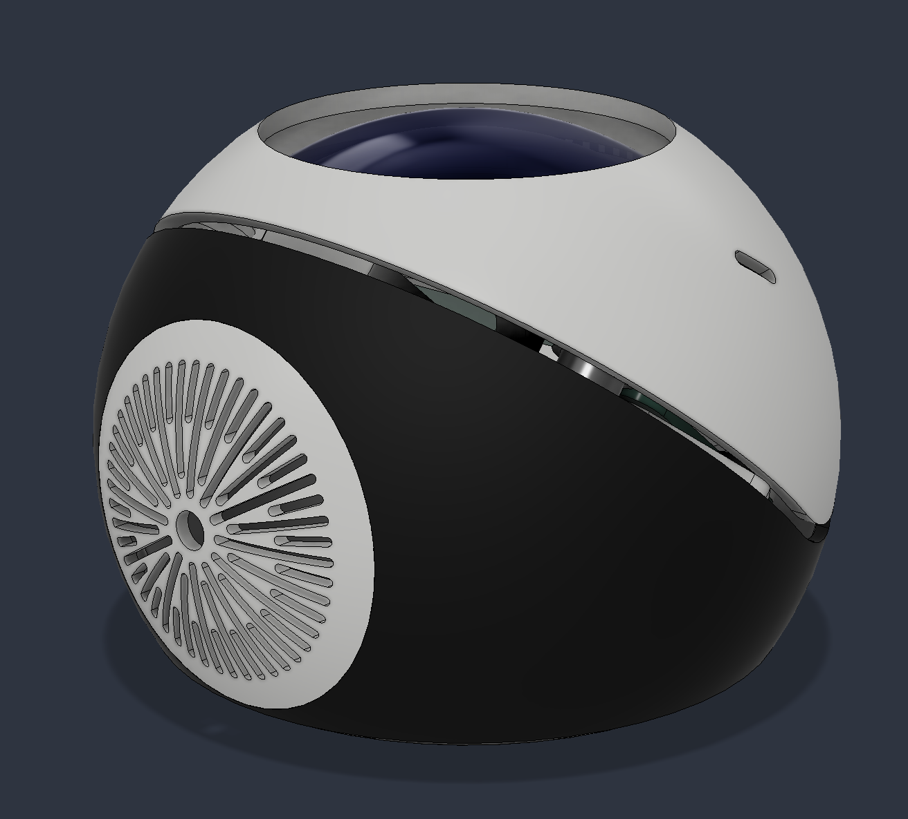
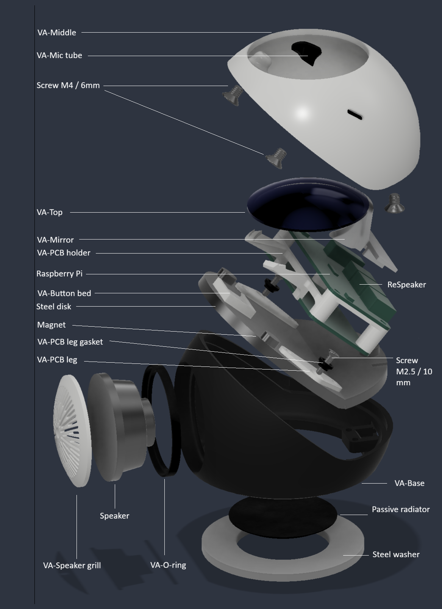
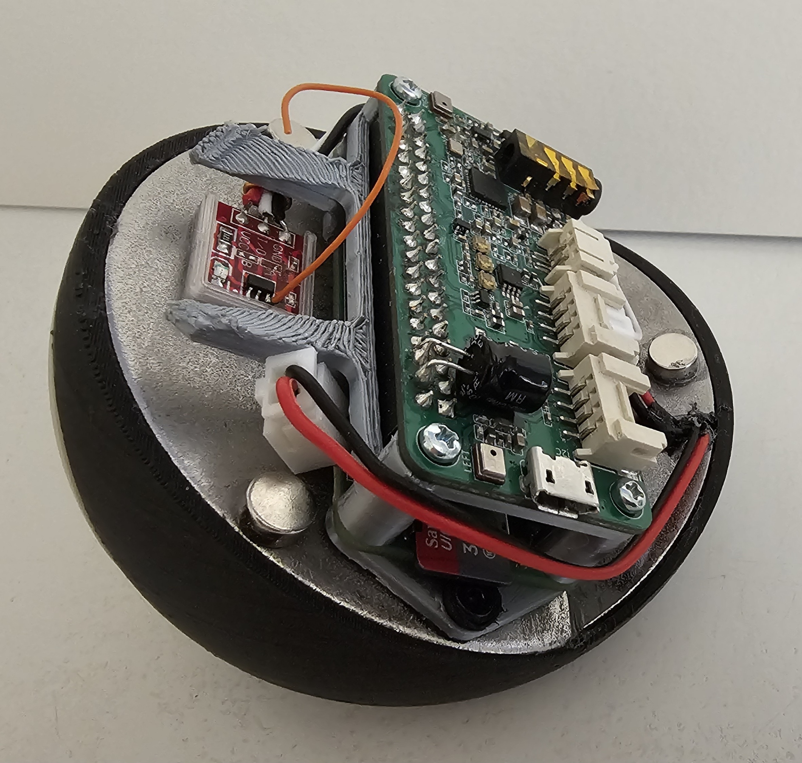
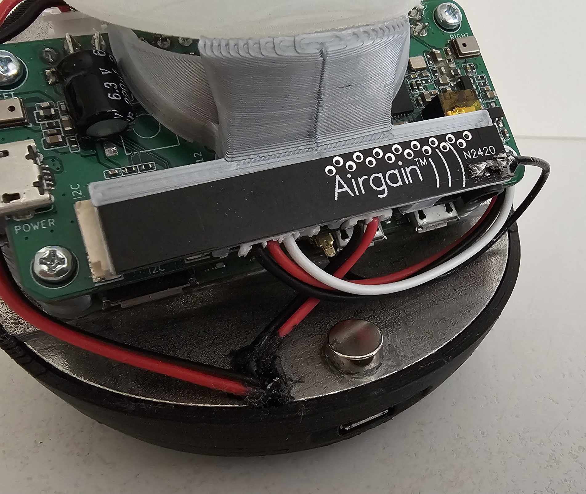

# Raspberry Pi Smart Speaker — Build Documentation

A spherical, full-duplex smart speaker built around a Raspberry Pi Zero 2W and a ReSpeaker 2-Mic HAT, with mechanical and acoustic design optimized for clean AEC (echo cancellation) at usable playback volumes.

## Design Goals

1. **Clean AEC at high volume** — the speaker should remain in its linear operating range across the useful volume range, so PipeWire's WebRTC AEC3 can maintain effective echo cancellation.
2. **Mic isolation from speaker vibration** — the microphones must hear room sound, not the enclosure's structural reaction to the driver.
3. **Adequate thermal dissipation** for the Pi SoC.
4. **Compact, aesthetically clean form** — spherical, with a clean visible parting line.
<br><br>



## Final Acoustic Architecture

| Decision | Choice | Rationale |
|---|---|---|
| Enclosure type | **Sealed or passive-radiator-loaded — selectable** | VA-Base's bottom washer hole accepts either insert: a **spile** (solid plug, no moving diaphragm) → plain sealed box; or a **passive radiator** (moving diaphragm, no motor) → passive-radiator-loaded box for reinforced bass without a second amplified driver. The steel washer seals/retains whichever insert is fitted. |
| Speaker mounting | Direct mount in VA-Base's front hole | Secured by **VA-Speaker grill**; sealed against the driver flange with **VA-O-ring** (TPU 95A). |
| PCB platform | Bent stainless-steel bracket, epoxied into VA-Base | A stainless steel disk with diameter 80 mm, cut into 2 parts (53.6 mm + 25.2 mm), bent at 40°, and glued with **VA-Stencil** as the jig; carries the M2.5-tapped mounts for the PCB legs and the cable slot.|
| Mic mounting | **VA-Mic tubes** (TPU 95A) sealed into VA-Middle | Acoustic tunnels between the ReSpeaker capsules and the outside. |
| Pi/HAT mounting | **VA-PCB holder** + **VA-PCB leg** (PLA top / TPU 95A bottom) | Legs bolt to the steel bracket through M2.5 threads; **VA-PCB leg gasket** (TPU 95A) sits between the leg's TPU foot and the bracket. |

## Exploded View


## 3D-Printed Parts

All spherical parts share an **82.8 mm outer diameter**.

| # | Part (STL) | Material | Print notes | Description |
|---|---|---|---|---|
| 1 | **VA-Base** | PLA | — | Speaker compartment, semi-sphere. Front: hole for a 40 mm 3 W speaker. Bottom: hole for either insert — a solid **spile** (sealed box) or a round low-frequency **passive radiator** ([source](https://www.aliexpress.com/item/1005003239721955.html)) — held/sealed in place by a standard steel washer, 60 mm OD × 34.8 mm ID × 3 mm thick ([source](https://www.aliexpress.com/item/1005006628614312.html)). Back: bed for a female micro-USB adapter ([source](https://www.aliexpress.com/item/32867946438.html)). |
| 2 | **VA-Middle** | PLA | — | RPi/ReSpeaker compartment, semi-sphere, same 82.8 mm diameter. 45 mm hole on top; two small side holes for the microphones. Also has three internal M4-threaded holes for countersink screws that stick to the magnets (see below). |
| 3 | **VA-Top** | PLA (semi-transparent) | Glued to VA-Mirror with super glue | Sits hollow-cheeked in VA-Middle's top hole; diffuses the ReSpeaker's status LEDs to the outside. |
| 4 | **VA-Speaker grill** | PLA | **0.2 mm nozzle** recommended for grille detail | Holds the speaker in place inside VA-Base. |
| 5 | **VA-Button bed** | PLA | Stuck to the steel bracket with double-sided adhesive tape | Mounting bed for the TTP223 touch sensor, positioned just under VA-Top, replacing the original mechanical button — see [Electrical Wiring](#electrical-wiring) below. |
| 6 | **VA-Mic tubes** | TPU 95A | Sealed into VA-Middle with super glue | Acoustic tunnels from the ReSpeaker mic capsules to VA-Middle's side holes. |
| 7 | **VA-Mirror** | PLA | Mirror surface painted with a mirror marker pen ([source](https://www.aliexpress.com/item/1005006677891105.html)); VA-Top glued to it with super glue | Redirects the ReSpeaker LEDs' light up into VA-Top; also mechanically supports VA-Top in position. |
| 8 | **VA-O-ring** | TPU 95A | — | Gasket between VA-Base and the speaker. |
| 9 | **VA-PCB holder** | PLA | — | Structure holding the RPi, ReSpeaker, and VA-Top. |
| 10 | **VA-PCB leg** | PLA (upper part) + TPU 95A (lower, concentric-circle part) | — | Fixes the PCB holder assembly to the steel bracket. |
| 11 | **VA-PCB leg gasket** | TPU 95A | — | Together with the leg's TPU foot, isolates the PCB structure from high-frequency vibration transmitted from the speaker compartment. |
| 12 | **VA-Stencil** | (jig, not part of final assembly) | — | Glue-up template for cutting/bending the steel bracket and for positioning the 3 magnets. |

## Steel Bracket (Purchased Stainless Disk, Cut + Bent)

Covers VA-Base's top opening, carrying the PCB assembly.

- Standard stainless steel disk, 3–4 mm thick ([source](https://www.aliexpress.com/item/1005011933984493.html)).
- Cut into two pieces: **53.6 mm** and **25.2 mm**.
- Bent to **40°**.
- Glued with **epoxy metal adhesive**, using **VA-Stencil** to hold the pieces in alignment while curing.
- Three holes per the stencil: two round, **M2.5**-tapped (left/right) to fix the PCB structure, and one slot beside the USB bed for the power and speaker cables to pass through.

## Magnets

- **3 × 8 mm diameter × 3 mm height.**
- Glued with super glue, or preferably **epoxy metal adhesive**.
- Positioned using the holes in **VA-Stencil**.

## Purchased Components

| Component | Spec | Source |
|---|---|---|
| Passive radiator (one of two bottom-hole insert options — see spile below) | sized to the washer's 34.8 mm ID aperture | [AliExpress](https://www.aliexpress.com/item/1005003239721955.html) |
| Spile (the other bottom-hole insert option) | solid plug, no moving diaphragm — makes VA-Base a plain sealed box instead | — |
| Steel washer | 60 mm OD × 34.8 mm ID × 3 mm thick — seals/retains whichever insert (spile or radiator) is fitted in VA-Base's bottom hole | [AliExpress](https://www.aliexpress.com/item/1005006628614312.html) |
| Female micro-USB adapter | — | [AliExpress](https://www.aliexpress.com/item/32867946438.html) |
| Stainless steel disk | 3–4 mm thick, standard | [AliExpress](https://www.aliexpress.com/item/1005011933984493.html) |
| Speaker | 40 mm, 3 W | — |
| Magnets | 8 mm ⌀ × 3 mm, ×3 | — |
| TTP223 touch sensor | GPIO13, active-HIGH — see [Electrical Wiring](#electrical-wiring) below | [AliExpress](https://www.aliexpress.com/item/1005005608987443.html) |
| Mirror marker pen | silvers VA-Mirror's reflective surface | [AliExpress](https://www.aliexpress.com/item/1005006677891105.html) |
| Heatsinks | 15 × 15 × 6.6 mm, ×2 (CPU + wireless module) | — |
| Thermal pad (optional, hot climates) | 2.3–2.5 mm thick, Pi board underside → steel bracket | — |
| External WiFi antenna (optional, if reception is weak) | see [WiFi Antenna](#wifi-antenna) below | — |
| Double-sided adhesive tape | sticks VA-Button bed to the steel bracket | — |
| Electrolytic capacitor | 100 µF / 6.3 V, soldered across Raspberry Pi power pins 4 and 6 for power smoothing | — |

## Electrical Wiring

1. **TTP223 touch sensor → ReSpeaker J4 connector:**
   - GND → pin 4
   - I/O → pin 2 (GPIO13)
   - VCC → pin 3

   The module is mounted just under VA-Top (VA-Button bed), instead of a mechanical button. VA-Button bed itself is stuck to the steel bracket with double-sided adhesive tape. A piece of wire is soldered to the module's touch pad and acts as an antenna, extending the touch-sensitive area up through VA-Top so the whole top surface responds to a touch rather than just the small board itself:

   

2. **Power (bypassing standard micro-USB):** a standard micro-USB port is too long to fit this construction. A male XH2.54 connector is soldered to Raspberry Pi pins 4 and 6, and the matching female XH2.54 is connected via a two-wire cable to the female USB-to-PAD adapter mounted in VA-Base's back bed. A **100 µF / 6.3 V electrolytic capacitor** is also soldered across pins 4 and 6, for power smoothing.

   The ReSpeaker HAT's own onboard button is not used and was removed.

3. **Speaker → ReSpeaker J2 connector:**
   - `−` → pin 2
   - `+` → pin 1
 
## WiFi Antenna

The Pi Zero 2W's onboard antenna sits close to the stainless steel bracket, which can attenuate WiFi reception. If you see connectivity trouble, add an external antenna as described in [this video](https://www.youtube.com/watch?v=IZqaKZLIqFg), and stick it to the bed on the back side of the VA-Mirror as shown here:



## Cooling

- A standard **15 × 15 × 6.6 mm heatsink** is fitted to each of the CPU and the wireless/communication module.
- The enclosure vents passively as a chimney: a **2 mm gap under VA-Middle** draws in cool air, and a **2+ mm gap between VA-Middle and VA-Top** exhausts warm air out the top.
- **In hot climates**, the stainless steel bracket can additionally serve as a heatsink for the whole Pi board — bond a **2.3–2.5 mm thick thermal pad** to the underside of the Pi board, against the bracket.

## Vibration Isolation

The speaker (in VA-Base) and the PCB assembly (RPi + ReSpeaker, in VA-PCB holder) are decoupled through two TPU 95A layers:

- **VA-O-ring** seals and decouples the speaker itself from VA-Base.
- **VA-PCB leg gasket**, together with the TPU (concentric-circle) foot of **VA-PCB leg**, isolates the PCB structure from high-frequency vibration transmitted through the steel bracket from the speaker compartment below.
- Don't fully tighten the **VA-PCB leg** screws into the steel bracket — leave them just loose enough that the whole PCB structure can wobble ever so slightly. Torquing them down solid re-introduces a hard, rigid contact path from the disk straight into the ReSpeaker microphones, defeating the gasket isolation above.

**VA-Mic tubes** (TPU 95A) carry mic pickup from the ReSpeaker capsules out through VA-Middle without a rigid path to the shell.

PipeWire/AEC/limiter setup and configuration live in [environment.md](../03-environment/environment.md) — see that doc for the echo-cancel module config, playback limiter, and routing verification.

## Testing & Validation

### Acoustic / Build Verification

1. **Pressure-leak test:** seal the speaker hole with your hand, press gently on VA-Base.
   - **With the spile fitted** (sealed box): pressure should release slowly. A quick release means a leak around the washer or USB bed.
   - **With the passive radiator fitted:** it's doing the compliance job now, so you should see *it* move/flex in response instead. If it doesn't move and pressure just leaks out around the washer or USB bed, that's a leak there.
2. **Tap test:** with everything assembled, tap VA-Base. The VA-PCB holder assembly above should feel *noticeably deader* than VA-Base — confirms the gasket isolation is working.
3. **Pink noise sweep:** `play -n -c 1 synth 30 pinknoise` (requires `sox`). Listen around the enclosure for buzzes, leaks, and rattles — pink noise reveals problems music masks.

### AEC Performance Verification

```bash
# Terminal 1 — play continuous tone through the full chain:
play -n synth 30 sine 1000

# Terminal 2 — record AEC output:
pw-record --target=aec_input aec_test.wav
# wait ~10 seconds, Ctrl+C, then:
pw-play aec_test.wav
```

The 1 kHz tone should be heavily attenuated in the recording. Repeat at progressively higher volumes; the level at which residual playback becomes audible defines your current AEC headroom.

### Thermal Verification

```bash
# Under sustained CPU load (e.g., audio processing):
watch -n 2 vcgencmd measure_temp
```

Pi Zero 2W should stabilize below ~70 °C under load. If it climbs higher, check thermal pad/paste contact pressure at the SoC, and whether the PCB holder gives the Pi enough clearance for passive convection.

## Vibration Bypass Paths — Pre-Build Checklist

The gasket-based isolation only works if the TPU layers are the **only** path from the speaker compartment to the PCB assembly. Verify before final assembly:

- [ ] **VA-O-ring** is correctly seated between the speaker and VA-Base — no metal-to-plastic contact bypassing it.
- [ ] **VA-PCB leg gasket** is seated flat between each leg's TPU foot and the steel bracket — no gaps, no crushed/rolled gasket.
- [ ] No metal-to-metal screw path exists between the steel bracket and the PCB holder that bypasses the TPU foot/gasket.
- [ ] Power/speaker cables through the bracket's cable slot are thin and have a service loop — not pulled taut.
- [ ] The steel bracket's epoxy bond (to VA-Base, via VA-Stencil alignment) has fully cured before load-testing.
- [ ] The bottom washer and USB bed are properly sealed — check for air leaks with the pressure test below.

## Materials Summary

| Material | Used for |
|---|---|
| PLA | VA-Base, VA-Middle, VA-Speaker grill, VA-Button bed, VA-Mirror, VA-PCB holder, VA-PCB leg (upper part) |
| PLA (semi-transparent) | VA-Top |
| TPU 95A | VA-Mic tubes, VA-O-ring, VA-PCB leg (lower, concentric-circle part), VA-PCB leg gasket |
| Stainless steel, 3–4 mm | Bracket cut from a purchased disk (53.6 mm + 25.2 mm pieces, bent 40°) |
| Epoxy metal adhesive | Steel bracket glue-up (via VA-Stencil), magnet mounting |
| Steel washer | Seals VA-Base's bottom hole, 60 mm OD × 34.8 mm ID × 3 mm |
| Magnets | 3 × 8 mm ⌀ × 3 mm |

## Design Notes To Expand

A few things worth documenting further once finalized — happy to add these when you have the details:

- Exact assembly order/sequence for the full stack.
- Cable routing detail from the bracket's slot through to the PCB.